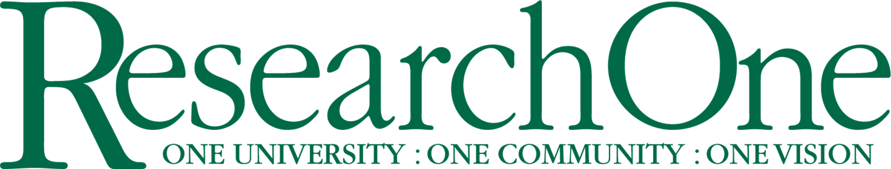

With the goal of providing a forum where Floridian researchers in economics can meet and exchange ideas, University of South Florida’s Department of Economics is happy to sponsor the 4th Annual WATE‐Florida. We hope you take this opportunity to submit a paper or participate in the conference to help strengthen the research community within the state of Florida.  

**Keynote Speakers**

<!--  -->

**The deadline for submissions is July 31, 2022.** Decisions will be made shortly thereafter. Please submit a PDF copy of your paper by email to [wate.fl.2022@gmail.com](mailto:wate.fl.2022@gmail.com), and refer to WATE-Florida in the subject line. See more in .

**Accommodations**

_Financial Aid: Unfortunately we do not have funds available to support individuals with the cost of participating in the conference._

---

**Organizing Committee:** Padmaja Ayyagari (chair), Diogo Baerlocher, and Giulia La Mattina

We acknowledge the kind support of:

<!--  -->

